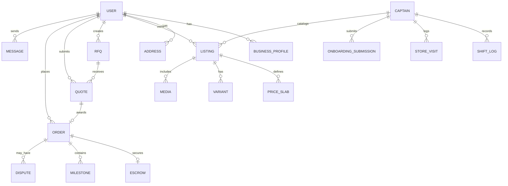

# JaxMart B2B Marketplace Platform — Complete Functionality & Feature Documentation

> **Project Name**: JaxMart Monorepo  
> **Platform Type**: B2B E-Commerce, Service Sourcing, RFQ, Escrow Marketplace & Field Operations ("Captain Flow")  
> **Document Version**: 2.2.0  
> **Target Audience**: Stakeholders, Developers, Product Managers, Sales Leads, Operations Teams & DevOps  

---

## [BLOCKER] PRODUCTION PENDING & EXTERNAL DEPENDENCIES (ACTION ITEMS FOR MANAGEMENT)

> [!IMPORTANT]
> The following core features and external vendor integrations are **architected and coded in development/sandbox mode**, but are currently **BLOCKED FOR PRODUCTION DEPLOYMENT** pending credentials, vendor API access, and business strategy decisions from leadership and external partners.

| # | Blocked Module | Current Status (Dev / Sandbox) | Exact Missing Input / Blocker from Management / Vendors |
|---|---|---|---|
| **1** | **Production SMS / WhatsApp OTP Gateway** | Simulated mock OTP (`123456`) in dev environment. | **No live SMS Gateway API access provided.** Management must approve and provide API Keys, DLT-registered Header/Sender ID, and approved SMS/WhatsApp templates (e.g. MSG91, Twilio, Gupshup, or Fast2SMS). |
| **2** | **Payment & Escrow Settlement Structure** | Razorpay Sandbox checkout and mock escrow ledger implemented. | **No live Payment & Banking Structure provided.** Management and banking partners must define: (a) Escrow / Nodal Bank Account setup, (b) Live Razorpay Route / Cashfree marketplace keys, (c) Marketplace commission fee percentage, (d) Seller payout settlement timeline ($T+1 / T+2$), and (e) Dispute refund rules. |
| **3** | **Subscription & Monetization Strategy** | Subscription database models and quota limits created in code. | **No business strategy or pricing model provided.** Management must finalize: (a) Exact plan pricing tiers (Monthly/Annual), (b) Specific feature quotas (Max RFQ bids/month, Max active listings), (c) Free trial rules, and (d) GST invoice taxation rules. |
| **4** | **Production Government KYC / KYB Verification APIs** | API Setu mock connector & simulated GSTIN/PAN validation active. | **Live Production Government API keys pending.** Access required for: (a) Live **API Setu (MeitY/DigiLocker)** Client ID & Secret, (b) Live GSTIN Portal verification API, (c) MCA Corporate Registry API, and (d) Live Bank Account Penny-Drop verification gateway. |
| **5** | **Production AWS S3 & CloudFront CDN Setup** | Local uploads / development S3 bucket stubs. | **Dedicated Production Cloud Infrastructure pending.** Need production AWS IAM credentials, private S3 bucket policies for encrypted KYC documents, and public S3 bucket with CloudFront CDN for fast media delivery. |
| **6** | **Production Transactional Email Service** | Console logger stubs. | **Production SMTP / SES / SendGrid credentials pending.** Required for automated buyer order receipts, seller RFQ alerts, KYC approval emails, and password resets. |
| **7** | **Production App Store & Maps Billing Setup** | Local Flutter / React Native builds. | **App Store accounts & Google Maps API key pending.** Google Play Developer Account, Apple Developer Account, production signing certificates, and Google Maps API Key with enabled billing for field GPS geocoding. |

---

## Table of Contents

1. [[BLOCKER] Production Pending & External Dependencies](#blocker-production-pending--external-dependencies-action-items-for-management)
2. [1. Executive Overview](#1-executive-overview)
3. [2. High-Level Architecture & Tech Stack](#2-high-level-architecture--tech-stack)
4. [3. Marketplace Core Modules & Features](#3-marketplace-core-modules--features)
   - [3.1 User Authentication & Role Management](#31-user-authentication--role-management)
   - [3.2 Government KYC & Business Identity Verification (API Setu)](#32-government-kyc--business-identity-verification-api-setu)
   - [3.3 Product & Service Catalog Management (SKUs & Slabs)](#33-product--service-catalog-management-skus--slabs)
   - [3.4 Discovery, Trigram Search & Filtering](#34-discovery-trigram-search--filtering)
   - [3.5 Request for Quote (RFQ) & Bidding Engine](#35-request-for-quote-rfq--bidding-engine)
   - [3.6 Orders, Escrow & Payment Processing](#36-orders-escrow--payment-processing)
   - [3.7 Real-Time Messaging & Collaboration (Inbox)](#37-real-time-messaging--collaboration-inbox)
   - [3.8 Subscription & Monetization System](#38-subscription--monetization-system)
   - [3.9 Admin Operations & Platform Governance](#39-admin-operations--platform-governance)
   - [3.10 Virtual B2B Exhibition / Expo Module (`/exhibit`)](#310-virtual-b2b-exhibition--expo-module-exhibit)
   - [3.11 Mobile Application (Flutter)](#311-mobile-application-flutter)
5. [4. Captain Flow & Field Sales Operations (Deep Dive)](#4-captain-flow--field-sales-operations-deep-dive)
   - [4.1 Hierarchy & Role Matrix (Captains, Admins, Super Admins)](#41-hierarchy--role-matrix-captains-admins-super-admins)
   - [4.2 Attendance, GPS Punch-In / Punch-Out & Shift Tracking](#42-attendance-gps-punch-in--punch-out--shift-tracking)
   - [4.3 On-Site Company / Seller Onboarding Wizard (7 Steps)](#43-on-site-company--seller-onboarding-wizard-7-steps)
   - [4.4 Field SKU & Barcode Cataloging Wizard (8 Steps)](#44-field-sku--barcode-cataloging-wizard-8-steps)
   - [4.5 Captain Daily Dashboard & Offline Draft Engine](#45-captain-daily-dashboard--offline-draft-engine)
   - [4.6 Admin & Super Admin Field Management Console](#46-admin--super-admin-field-management-console)
6. [5. Completed Web Route Directory](#5-completed-web-route-directory)
7. [6. Completed Backend API Directory](#6-completed-backend-api-directory)
8. [7. Captain Field APIs & Database Schema Extensions](#7-captain-field-apis--database-schema-extensions)
9. [8. Data Models & Database Schema Overview](#8-data-models--database-schema-overview)

---

## 1. Executive Overview

**JaxMart** is a next-generation B2B wholesale commerce, service procurement, and field sales enablement platform. It bridges the gap between verified manufacturers, wholesalers, suppliers, corporate buyers, and on-ground sales teams.

The platform provides a dual operational model:
1. **Online Marketplace**: Digital self-serve B2B store for catalog discovery, bulk slab pricing, RFQ bidding, escrow payments, and live chat.
2. **On-Ground Field Operations ("Captain Flow")**: Dedicated field sales force automation for Business Analysts, Sales Representatives, and Marketing Executives ("Captains") to physically visit wholesale markets, punch in/out with GPS, onboard verified suppliers on-site, scan barcodes, and catalog SKUs with offline support.

---

## 2. High-Level Architecture & Tech Stack

```
                                  ┌────────────────────────────────────────────────────────┐
                                  │                  JAXMART MONOREPO                      │
                                  └──────────────────────────┬─────────────────────────────┘
                                                             │
             ┌───────────────────────────────────────────────┼───────────────────────────────────────────────┐
             ▼                                               ▼                                               ▼
   ┌──────────────────┐                            ┌──────────────────┐                            ┌──────────────────┐
   │    WEB PORTAL    │                            │   MOBILE APPS    │                            │  BACKEND ENGINE  │
   │  Next.js 14 Web  │                            │ Flutter & ReactN │                            │ Node.js/Express  │
   │ • Buyer Store    │                            │ • Flutter Buyer  │                            │ • REST + Socket  │
   │ • Seller Portal  │                            │ • Flutter Seller │                            │ • PostgreSQL DB  │
   │ • Admin Console  │                            │ • Captains App   │                            │ • Escrow/Razorpay│
   │ • Super Admin    │                            │   (Field Ops)    │                            │ • API Setu KYC   │
   └──────────────────┘                            └──────────────────┘                            └──────────────────┘
```

| Layer | Technologies | Purpose |
|---|---|---|
| **Backend API** | Node.js 20, Express.js, Prisma ORM | Core business logic, secure REST endpoints, Socket.io server |
| **Database** | PostgreSQL 16 (`pg_trgm`, `unaccent`) | Relational database with full-text fuzzy search & ACID compliance |
| **Caching & PubSub** | Redis 7 | High-speed cache, session management, event queue |
| **Web Frontend** | Next.js 14 (App Router), TypeScript, Tailwind CSS | Responsive web application for Buyers, Sellers, Admins & Super Admins |
| **Mobile App (Marketplace)** | Flutter 3.16 (Dart), Riverpod 2 | Cross-platform (iOS/Android) mobile buyer & seller app |
| **Mobile App (Field Captains)**| React Native / Flutter (TypeScript / Dart) | Offline-first field app with GPS lock, barcode scanner & signature canvas |
| **Payments & Escrow** | Razorpay, Escrow Ledger Engine | Safe B2B payments, milestone-based escrow release |
| **KYC Integration** | API Setu (MeitY/DigiLocker), GSTIN API | Automated Government of India business identity check |
| **Object Storage** | AWS S3, Multer | Media storage for images, videos, brochures, and KYC docs |

---

## 3. Marketplace Core Modules & Features

### 3.1 User Authentication & Role Management
* **Flexible Role System**:
  * `BUYER`: Discovers products, posts RFQs, compares quotes, places orders, and manages deliveries.
  * `SELLER`: Accesses the Seller Dashboard, catalogs SKUs, manages inventory, submits quotes, and tracks payouts.
  * `BOTH`: Seamlessly toggle between Buyer and Seller capabilities under one single account.
  * `ADMIN` & `SUPER_ADMIN`: Accesses governance, dispute resolution, KYC reviews, Captain management, and platform analytics.
* **Authentication Channels**:
  * Indian Mobile Number + SMS OTP verification.
  * Email + Password authentication.
* **Session & Security**:
  * Dual-token JWT architecture (Short-lived Access Token + Secure Refresh Token).
  * Role-Based Access Control (RBAC) middleware guarding API endpoints.
* **Business Address Management**:
  * Multi-address support per account (`PRIMARY`, `BILLING`, `SHIPPING`, `WAREHOUSE`, `BRANCH`).

---

### 3.2 Government KYC & Business Identity Verification (API Setu)

```
┌──────────────────┐      ┌──────────────────┐      ┌──────────────────┐      ┌──────────────────┐
│ Business Profile │ ───► │ GSTIN & PAN      │ ───► │ Bank Account     │ ───► │ Admin Approval / │
│ Entity Type, Name│      │ API Setu Lookup  │      │ IFSC & Cheque    │      │ Verified Badge   │
└──────────────────┘      └──────────────────┘      └──────────────────┘      └──────────────────┘
```

* **Automated GSTIN Verification**:
  * 15-character GSTIN format validation.
  * Direct integration with **API Setu (Govt. of India)** to fetch Legal Entity Name, Trade Name, Registration Status, and Date of Incorporation.
  * Upload GST Registration Certificate (PDF/Image).
* **PAN Card Verification**:
  * Proprietor and Corporate 10-character PAN validation.
  * Document verification and PAN card photo capture.
* **Bank & Settlement Verification**:
  * Bank Account Number & IFSC code auto-lookup (pulls Branch and Bank Name).
  * Cancelled cheque or bank passbook upload.
  * Automated penny-drop verification support.
* **Regulatory Document Uploads**:
  * MSME / Udyam Registration Certificate.
  * FSSAI License (Mandatory for Food/Agriculture sellers).
  * Shop & Establishment / Trade License.
* **Status Lifecycle**:
  * States: `PENDING` -> `UNDER_REVIEW` -> `VERIFIED` or `REJECTED` (with custom rejection reasons sent to seller).
  * Verified sellers receive the "Verified Supplier" shield badge across all product listings.

---

### 3.3 Product & Service Catalog Management (SKUs & Slabs)
* **Dual Listing System**: Supports physical **Products** and customized B2B **Services**.
* **Hierarchical Taxonomy**: Multi-level Category and Subcategory taxonomy with pre-seeded datasets (Electronics, Construction, Textiles, Industrial Equipment, Professional Services).
* **B2B Bulk Tier Slab Pricing**:
  * Enables sellers to configure wholesale discounts based on order volume.
  * Example:
    * Tier 1: 10 – 50 units -> Rs 500 / unit
    * Tier 2: 51 – 200 units -> Rs 450 / unit
    * Tier 3: 201+ units -> Rs 400 / unit
* **Minimum Order Quantity (MOQ)**: Configurable threshold to prevent retail/single-unit orders.
* **Tax & HSN Engine**:
  * 4 to 8-digit HSN/SAC codes.
  * GST rate selection (`0%`, `5%`, `12%`, `18%`, `28%`) + optional Cess percentage.
  * Tax Inclusive vs. Exclusive pricing toggle.
* **Barcode & SKU Identification**:
  * Barcode support (EAN-13, UPC-A, Code-128).
  * Manufacturer part numbers and internal auto-generated JaxMart SKU numbers.
* **Variants & Dynamic Attributes**:
  * Dynamic variants (e.g. Size, Color, Gauge, Material, Power Rating).
* **Packaging & Logistics Parameters**:
  * Dead weight, volumetric dimensions ($L \times W \times H$), pallet size, and handling precautions.
* **Rich Media**: Multi-angle image uploads, video demonstrations, and downloadable technical specification brochures (PDFs) stored in AWS S3.
* **Catalog Status Controls**: `DRAFT`, `ACTIVE`, `PAUSED`, `REJECTED`, `ARCHIVED`.

---

### 3.4 Discovery, Trigram Search & Filtering
* **High-Speed Fuzzy Search**:
  * Powered by PostgreSQL Trigram (`pg_trgm`) index and `unaccent` extension.
  * Performs typo-tolerant matching across titles, descriptions, categories, brand names, and tags.
* **Comprehensive Filter Matrix**:
  * Category & Subcategory selection.
  * Price Range slider (Min/Max).
  * Minimum Order Quantity (MOQ) filter.
  * Location filter (City, State, Pincode).
  * Verified Suppliers only toggle.
  * In-stock / Ready-to-ship filter.
* **Product Detail Page**:
  * Interactive Tier Price Calculator: Total cost updates dynamically as the buyer types order quantity.
  * Specification data sheets and downloadable brochures.
  * Direct action buttons: "Request Quote" or "Buy Now".
* **Seller Storefront**: Public profile showing company details, verified badges, rating, operational history, and full product line.

---

### 3.5 Request for Quote (RFQ) & Bidding Engine

```
┌────────────────────┐       ┌────────────────────┐       ┌────────────────────┐
│  Buyer Posts RFQ   │ ────► │  Matching Sellers  │ ────► │  Sellers Submit    │
│ Specs, Qty, Target │       │  Get Notified      │       │  Granular Quotes   │
└────────────────────┘       └────────────────────┘       └────────────────────┘
                                                                     │
┌────────────────────┐       ┌────────────────────┐                  │
│ Order & Escrow     │ ◄──── │ Buyer Shortlists   │ ◄────────────────┘
│ Created Auto       │       │ & Awards Quote     │
└────────────────────┘       └────────────────────┘
```

* **RFQ Creation Wizard (Buyer)**:
  * Specify Product/Service title, description, required quantity, target unit price, expected delivery date, and delivery location.
  * Upload custom technical specifications, drawings, or RFP documents.
  * Visibility Options: `PUBLIC` (all category suppliers), `PRIVATE`, or `TARGETED` (specific vendors).
* **Automated Seller Matching Engine**:
  * Matches newly posted RFQs to verified sellers based on category, product capabilities, and geography.
* **Seller Quote Submission Tool**:
  * Detailed cost breakdown: Base Unit Price, Packaging Fees, Freight/Logistics Charges, Applicable Taxes, Payment Terms, Lead Time, and Quote Expiry Date.
* **Buyer Comparison & Awarding Dashboard**:
  * Side-by-side comparison of competing quotes.
  * Actions: `SHORTLIST`, `ACCEPT` (Awards the deal), `REJECT`, or open a direct negotiation chat.
  * Accepting a quote automatically generates an Order and sets up the Escrow payment record.

---

### 3.6 Orders, Escrow & Payment Processing
* **Payment Gateway**: Seamless integration with **Razorpay** supporting UPI, Net Banking, Credit/Debit Cards, and Corporate Bank Transfers (NEFT/RTGS).
* **B2B Escrow System**:
  * Funds paid by the buyer are safely held in escrow (`HELD`).
  * Escrow funds are released to the seller (`FULLY_RELEASED` or `PARTIAL_RELEASED`) only after buyer delivery confirmation or milestone sign-off.
* **Milestone Payments for Services**:
  * Supports staged release of funds (e.g. 20% advance upon start, 40% upon intermediate milestone, 40% upon completion).
* **Order Status Workflow**:
  * `CREATED` -> `ACCEPTED` -> `ACTIVE` -> `SHIPPED` -> `DELIVERED` -> `COMPLETED`.
  * Visual progress tracker on both Web and Mobile.
* **Dispute & Refund Mediation**:
  * Buyers can raise disputes (`DISPUTED`) if shipments are defective or delayed.
  * Dispute console locks escrow funds until Admin reviews evidence and executes refunds or payouts.

---

### 3.7 Real-Time Messaging & Collaboration (Inbox)
* **Socket.io Powered Real-Time Engine**: Zero-latency instant messaging between buyers and sellers.
* **Contextual Conversations**:
  * Chat threads are automatically tagged to a specific **Product Listing**, **RFQ**, or **Active Order**.
  * Shows a persistent product/quote snapshot card at the top of the chat.
* **Rich Attachments**: Send documents, PDF quotes, test reports, and sample images directly within the conversation.
* **Read Receipts & Unread Badges**: Real-time delivery status, unread counts, and notification alerts.

---

### 3.8 Subscription & Monetization System
* **Tiered Subscription Plans**:
  * E.g. `Starter`, `Growth`, `Enterprise`, `Pro Supplier`.
  * Configurable limits on monthly RFQ quotes, number of active catalog listings, priority search placement, and verified badge.
* **Billing Cycles**: Monthly and Annual recurring subscription billing with automated invoicing.
* **Admin Subscription Control**:
  * Create custom plans, adjust pricing, modify feature quotas, and view subscriber revenue analytics.

---

### 3.9 Admin Operations & Platform Governance
* **Platform Health Metrics**: Real-time Gross Merchandise Value (GMV), total orders, active listings, and user counts.
* **KYC Approval Desk**: Side-by-side document review (GST, PAN, Cheque) with single-click `Approve` or `Reject with custom notes`.
* **Catalog Moderation**: Audit product listings, flag non-compliant goods, and suspend fraudulent items.
* **Dispute Resolution Console**: Review buyer/seller claims, inspect evidence, and disburse escrow funds accordingly.
* **User Management**: View user history, assign badges, or deactivate abusive accounts.

---

### 3.10 Virtual B2B Exhibition / Expo Module (`/exhibit`)
* **Virtual Trade Hall**: Digital trade expo portal for industrial sectors to host online exhibitions.
* **Exhibitor Stalls & Booths**: Virtual stalls showcasing company branding, video tours, and highlighted product catalogs.
* **Live Inquiries**: Direct "Visit Stall" and "Exchange Business Card / Inquire" interactive buttons.
* **Event Schedule**: Schedule of upcoming trade events with attendee registration workflows.

---

### 3.11 Mobile Application (Flutter)
* **Cross-Platform App (`mobile/`)**:
  * **Buyer App**: Splash & Onboarding, Category browsing, Search & Filters, and Step-by-step RFQ creation.
  * **Seller Dashboard**: Active orders overview, product catalog status, and revenue indicators.
  * **Order Tracking Screen**: Timeline tracking with payment and shipment status.

---

## 4. Captain Flow & Field Sales Operations (Deep Dive)

The **Captain Flow** is designed for on-ground sales representatives, business analysts, and marketing executives who go into physical wholesale markets, industrial clusters, and trade hubs to onboard sellers and digitize their product catalogs.

```
┌──────────────────────────────────────────────────────────────────────────┐
│                             SUPER ADMIN                                  │
│  (Platform Owner, Head of Sales, VP Operations)                         │
│  • Global targets, Territory definitions, Incentive rules, System logs   │
└────────────────────────────────────┬─────────────────────────────────────┘
                                     │
┌────────────────────────────────────▼─────────────────────────────────────┐
│                            ADMIN / CITY LEAD                             │
│  (Territory Manager, Regional Operations Lead)                           │
│  • Captain provisioning, Beat routes, Live map tracking, Approvals       │
└────────────────────────────────────┬─────────────────────────────────────┘
                                     │
┌────────────────────────────────────▼─────────────────────────────────────┐
│                        CAPTAIN (FIELD SALES REP)                         │
│  (Business Analyst, Field Agent, Marketing Executive)                   │
│  • Punch In/Out, Store visits, 7-Step Onboarding, 8-Step Barcode SKU     │
└──────────────────────────────────────────────────────────────────────────┘
```

---

### 4.1 Hierarchy & Role Matrix

| Role | Access Level | Primary Responsibilities |
|---|---|---|
| **Super Admin** | Platform-Wide | Defines States/Cities/Zones, sets global commission rules, views macro revenue & performance KPIs, manages Admin accounts. |
| **Admin / City Lead** | City / Territory Level | Provisions Captain accounts, assigns daily routes/beat plans, monitors live GPS tracking, audits submitted onboardings & SKUs. |
| **Captain** | Field Mobile App | Punches in/out with GPS & selfie, visits retail/wholesale stores, onboard companies on-site, scans barcodes, catalogs SKUs. |

---

### 4.2 Attendance, GPS Punch-In / Punch-Out & Shift Tracking

Captains are strictly required to clock in before accessing onboarding or SKU cataloging tools.

1. **Punch-In (Start Shift)**:
   * **GPS Lock**: High-accuracy GPS capture (Latitude, Longitude, Accuracy, Altitude).
   * **Reverse Geocoding**: Automatically resolves and records the physical street address, city, and pincode.
   * **Selfie Verification**: Live camera photo with timestamp & GPS watermark.
   * **Battery & Connectivity**: Logs battery percentage and network strength.
   * **Assigned Beat Plan**: Displays today's target store list and assigned route.

2. **Active Shift Mode**:
   * Persistent top status banner: `Active Shift | Duration: 04h 15m | Clocked In: 09:30 AM`.
   * Live dashboard metrics:
     * Stores Visited Today
     * Companies Onboarded Today
     * SKUs Cataloged Today
     * Target Progress Bar (e.g. *5 / 8 Stores Completed*)

3. **Punch-Out (End Shift)**:
   * Requires confirmation modal with shift summary:
     * Total hours clocked in.
     * Summary of completed onboardings & SKUs.
     * Count of pending offline drafts (prompts Captain to sync before logging out).
   * Captures ending GPS coordinates and timestamps.

---

### 4.3 On-Site Company / Seller Onboarding Wizard (7 Steps)

Replaces all physical paperwork with an interactive, offline-ready form wizard:

```
 Step 1          Step 2          Step 3          Step 4          Step 5          Step 6          Step 7
┌───────┐       ┌───────┐       ┌───────┐       ┌───────┐       ┌───────┐       ┌───────┐       ┌───────┐
│ Basic │ ────► │ Store │ ────► │ GST & │ ────► │ Bank  │ ────► │ Biz   │ ────► │ Legal │ ────► │ Final │
│ Info  │       │ GPS   │       │ PAN   │       │ Proof │       │ Scope │       │ Sign  │       │ Submit│
└───────┘       └───────┘       └───────┘       └───────┘       └───────┘       └───────┘       └───────┘
```

* **Step 1: Basic Business Profile**:
  * Legal Business Name (matches PAN/GST) & Trade/Shop Name.
  * Entity Type: *Sole Proprietorship, Partnership, Private Limited, Public Limited, LLP, OPC, Unregistered*.
  * Primary Contact Person, Mobile Number (with OTP verification), Email, and Preferred Language.
* **Step 2: Geolocation & Physical Store Address**:
  * **GPS Auto-Fetch Button**: Captures precise coordinates of the store entrance.
  * **Interactive Map Pin-Drop**: Fine-tune map pin placement.
  * Full physical address: Shop number, Street, Landmark, City, State, Pincode.
  * **Storefront Photo Capture** (Mandatory camera photo of shop name board).
  * **Store Interior Photo Capture** (Mandatory camera photo inside shop/warehouse).
* **Step 3: Business Identity, GSTIN & PAN Verification**:
  * GST toggle: If *Yes*, enter 15-character GSTIN -> Trigger **API Setu** lookup to auto-populate Trade Name, Legal Name, Address, and Filing status.
  * Upload GST Registration Certificate (PDF or Camera photo).
  * Business / Proprietor PAN Number & Name on PAN.
  * PAN Card photo capture.
  * Optional licenses: MSME/Udyam, FSSAI (mandatory for food items), Shop & Establishment license.
* **Step 4: Financial & Settlement Bank Details**:
  * Account Holder Name & Bank Name.
  * Account Type: *Current Account* or *Savings Account*.
  * Account Number (with masked re-entry confirmation).
  * IFSC Code (with auto-lookup for Branch Name and City).
  * Cancelled Cheque / Bank Passbook photo upload.
  * Automated penny-drop verification trigger.
* **Step 5: Business Operations & Category Selection**:
  * Primary Business Categories & Sub-categories (Grocery, Electronics, Hardware, Apparel, Industrial, etc.).
  * Estimated inventory turnover range (`< Rs 1L`, `Rs 1L–5L`, `Rs 5L–20L`, `> Rs 20L`).
  * Operational days and opening/closing hours.
  * Delivery capabilities (*Self Delivery / Pickup Only / JaxMart Logistics*).
* **Step 6: Legal Agreement & Digital Sign-Off**:
  * Terms & Conditions contract viewer.
  * **Digital Signature Pad**: Seller signs directly on the mobile screen with touch/stylus.
  * **Captain Declaration**: Checkbox confirming *"I, [Captain Name], have physically visited the store and verified all submitted documents."*
* **Step 7: Review, Submission & Status Tracking**:
  * Comprehensive summary card with edit links for every step.
  * Action buttons: `[ Save as Offline Draft ]` or `[ Submit for Admin Review ]`.
  * Generates a unique **Seller ID, QR Code**, and status badge: `[ Pending Admin Approval ]`.

---

### 4.4 Field SKU & Barcode Cataloging Wizard (8 Steps)

Allows Captains to digitize inventory on-site directly from product boxes:

1. **Step 1: Select Onboarded Seller & Product Basics**: Choose from Captain's onboarded sellers; enter Product Title, Brand Name, Category, Subcategory, and HSN/SAC Code.
2. **Step 2: Barcode & Identification Scanner**:
   * Uses the device camera to scan **EAN-13, UPC-A, Code-128, or QR codes** on packaging.
   * Auto-populates barcode number and checks for duplicates against the global JaxMart catalog.
3. **Step 3: Commercial Pricing, Taxes & B2B Tier Slabs**:
   * Maximum Retail Price (MRP) & Base Wholesale Selling Price (B2B Price).
   * GST Tax Dropdown (`0%`, `5%`, `12%`, `18%`, `28%`) + Cess percentage.
   * Tax Inclusive vs. Exclusive toggle.
   * Minimum Order Quantity (MOQ).
   * **B2B Bulk Tier Pricing Matrix** (e.g. 10–50 units @ Rs 500, 51–200 units @ Rs 450, 201+ units @ Rs 400).
4. **Step 4: Variants & Custom Attributes**: Add color, size, gauge, material, or technical specs.
5. **Step 5: Inventory & Warehouse Specs**: Current available stock quantity, low-stock alert threshold, warehouse shelf location.
6. **Step 6: Packaging & Logistics Dimensions**: Dead weight (kg), packaging dimensions ($L \times W \times H$ in cm), volumetric weight, master carton quantity.
7. **Step 7: Multi-Angle Media Capture**: Mandatory Front photo, Back packaging photo, Barcode/label photo, and product in-use photo.
8. **Step 8: Compliance, Review & Submit**: Enter warranty details, country of origin, and submit or save as offline draft.

---

### 4.5 Captain Daily Dashboard & Offline Draft Engine

* **Daily Target vs. Achievement Widget**: Circular progress ring showing daily onboarding quota and SKU targets.
* **Offline-First Architecture**:
  * All onboarding forms and SKU entries are saved locally using SQLite / MMKV / AsyncStorage.
  * Automatic background sync when internet connection is restored.
  * Visual sync indicator: `[Synced]` or `[Drafts Pending]`.
* **My Onboarded Companies List**: Directory of all shops onboarded by this Captain, showing verification status (`Approved`, `Pending`, `Rejected`).
* **Route & Attendance History**: View past shift logs, hours worked, and visited stores calendar.

---

### 4.6 Admin & Super Admin Field Management Console

```
┌────────────────────────────────────────────────────────────────────────┐
│                   ADMIN & SUPER ADMIN CONTROL CENTER                   │
├───────────────────┬───────────────────┬────────────────────────────────┤
│ Live Captain      │ Captain           │ Onboarding Audit Desk          │
│ Tracking & Routes │ Provisioning      │ Review Storefronts, GST & Bank │
├───────────────────┼───────────────────┼────────────────────────────────┤
│ SKU Catalog       │ Targets & KPIs    │ Performance                    │
│ Moderation Desk   │ Incentives & Quota│ Analytics & Leaderboard        │
└───────────────────┴───────────────────┴────────────────────────────────┘
```

1. **Captain Provisioning & Zone Allocation**:
   * Create Captain accounts (Accounts cannot self-register; must be provisioned by Admin).
   * Assign employee code, mobile login credentials, assigned city, territory zones, and monthly quotas.
2. **Live Field Tracking & Attendance Ledger**:
   * **Real-time Map**: Visual map displaying active pins of all currently clocked-in Captains.
   * **Breadcrumb Route Playback**: Review the exact path a Captain traveled throughout their shift.
   * **Geo-fencing Alerts**: Flag punch-ins that occur outside the assigned market zone.
3. **Onboarding Audit Desk**:
   * Queue of submitted companies.
   * Side-by-side comparison of storefront photo, interior photo, API Setu GST records, bank passbook, and digital signature.
   * Single-click `Approve & Activate Seller` or `Reject with Reason` (sent instantly to Captain's app).
4. **SKU Catalog Moderation Desk**:
   * Audit field-cataloged SKUs for image clarity, correct B2B slab pricing, valid HSN codes, and barcode uniqueness.
5. **Performance Analytics & Leaderboards**:
   * Real-time rankings of top-performing Captains by onboardings, catalog velocity, and verification approval rates.
   * Incentive calculations based on approved onboardings.

---

## 5. Completed Web Route Directory

All web pages are located in `web/src/app`:

| Route Path | Page Description & Key Functionality |
|---|---|
| `/` & `/home` | Marketplace Homepage, featured categories, trending products, banners |
| `/auth/login` | Phone / Email login & OTP verification screen |
| `/auth/setup` | Post-signup profile, business details & role configuration |
| `/search` | Full-text & Trigram search with filters (category, price, MOQ, location) |
| `/listings/[id]` | Product & Service detail page with dynamic tier price calculator & specs |
| `/rfq` | Buyer RFQ explorer & management dashboard |
| `/rfq/create` | Step-by-step RFQ creation wizard |
| `/rfq/[id]` | RFQ detail page: quotes comparison & awarding console |
| `/seller/dashboard` | Seller performance metrics, sales overview, quick actions |
| `/seller/listings` | Seller catalog table: status, price edits, inventory toggle |
| `/seller/listings/new` | Multi-step Product & Service creation wizard (Slabs, variants, media) |
| `/seller/rfq-inbox` | Seller RFQ opportunities inbox & quote submission modal |
| `/orders` | Buyer & Seller Order list with status filters |
| `/orders/[id]` | Order detail view with tracking timeline & escrow status |
| `/inbox` | Real-time buyer-seller chat with product & RFQ contextual cards |
| `/profile` | User profile, company information, KYC submission & address book |
| `/exhibit` | Virtual B2B exhibition stalls & event registration |
| `/survey` | Multi-step interactive survey & feedback form |
| `/admin` | Admin dashboard: KYC desk, listing moderation, user management |
| `/admin/login` | Admin dedicated secure login portal |

---

## 6. Completed Backend API Directory

All core backend endpoints are located in `backend/src/routes`:

| Route Prefix | Controller | Key Functionalities |
|---|---|---|
| `/api/auth` | `authController.js` | User registration, login, phone OTP verification, token refresh, logout |
| `/api/users` | `userController.js` | Profile retrieval/updates, address book CRUD operations |
| `/api/kyc` | `kycController.js` | GSTIN verification, PAN verification, bank settlement setup, API Setu connector |
| `/api/categories` | `categoryController.js` | Hierarchical categories, subcategories, attribute templates |
| `/api/listings` | `listingController.js` | Product/Service CRUD, tier slabs, variants, full-text search, filters |
| `/api/rfqs` | `rfqController.js` | Post RFQ, match sellers, submit quotes, shortlist, award quotes |
| `/api/orders` | `orderController.js` | Create order, Razorpay order creation, payment verification, order tracking |
| `/api/payments` | `paymentController.js` | Escrow ledger, Razorpay webhooks, milestone fund releases, refunds |
| `/api/messages` | `messageController.js` | Conversation threads, message history, unread counters, Socket.io integration |
| `/api/subscriptions` | `subscriptionController.js` | Plan purchase, tier verification, feature quota enforcement |
| `/api/admin` | `adminController.js` | Platform metrics, KYC approval/rejection, listing audit, disputes mediation |
| `/api/upload` | `uploadController.js` | AWS S3 multi-part image, document & PDF uploads |
| `/api/events` | `eventController.js` | Exhibition stalls, booth registration & event scheduling |
| `/api/notifications`| `notificationController.js`| User in-app notification list, mark as read, event triggers |

---

## 7. Captain Field APIs & Database Schema Extensions

### A. Captain REST API Endpoints

```
Captain Field APIs:
POST /api/captain/shift/punch-in       -> Clock-in with GPS, selfie, and battery health
POST /api/captain/shift/punch-out      -> Clock-out with GPS & shift summary
GET  /api/captain/shift/current        -> Retrieve current active shift duration & status
GET  /api/captain/dashboard            -> Daily targets, visited count, onboarded count, draft count
POST /api/captain/store-visits         -> Log a physical store visit (with GPS & outcome)
POST /api/captain/onboard-seller       -> Submit a complete 7-step onboarding payload
GET  /api/captain/my-sellers           -> List all sellers onboarded by this Captain
POST /api/captain/catalog-sku          -> Catalog a product SKU with barcode, pricing slabs & media

Admin & Super Admin Field Ops APIs:
GET  /api/admin/captains               -> List all Captains (filter by city, zone, status)
POST /api/admin/captains               -> Provision a new Captain account & assign zone
GET  /api/admin/captains/live-map      -> Real-time GPS locations of all active Captains
GET  /api/admin/captains/:id/history   -> Attendance logs, shift hours, and route breadcrumbs
GET  /api/admin/onboardings/pending    -> Queue of submitted company onboardings for review
POST /api/admin/onboardings/:id/review -> Approve or reject company onboarding with notes
GET  /api/admin/skus/pending           -> Queue of cataloged SKUs for audit
POST /api/admin/skus/:id/review        -> Approve or reject cataloged SKU
GET  /api/admin/analytics/leaderboard  -> Performance rankings, targets vs. achievements
```

### B. Captain Prisma Models

```prisma
// Captain Profile
model Captain {
  id              String         @id @default(uuid())
  userId          String         @unique
  user            User           @relation(fields: [userId], references: [id])
  employeeCode    String         @unique
  assignedCity    String
  assignedZone    String
  managerId       String?
  status          CaptainStatus  @default(ACTIVE)
  dailyTarget     Int            @default(5)
  monthlyTarget   Int            @default(100)
  
  shifts          ShiftLog[]
  storeVisits     StoreVisit[]
  onboardings     OnboardingSubmission[]
  catalogedSkus   Listing[]
  
  createdAt       DateTime       @default(now())
  updatedAt       DateTime       @updatedAt
}

enum CaptainStatus {
  ACTIVE
  ON_LEAVE
  SUSPENDED
  DEACTIVATED
}

// Attendance & Punch In/Out
model ShiftLog {
  id              String         @id @default(uuid())
  captainId       String
  captain         Captain        @relation(fields: [captainId], references: [id])
  
  punchInTime     DateTime       @default(now())
  punchInLat      Float
  punchInLng      Float
  punchInAddress  String?
  punchInSelfie   String?
  
  punchOutTime    DateTime?
  punchOutLat     Float?
  punchOutLng     Float?
  punchOutAddress String?
  
  totalMinutes    Int?
  status          ShiftStatus    @default(ACTIVE)
  
  createdAt       DateTime       @default(now())
}

enum ShiftStatus {
  ACTIVE
  COMPLETED
  AUTO_CLOSED
}

// Store Visits & Beat Plan
model StoreVisit {
  id              String         @id @default(uuid())
  captainId       String
  captain         Captain        @relation(fields: [captainId], references: [id])
  storeName       String
  contactPerson   String?
  phone           String?
  lat             Float
  lng             Float
  visitOutcome    VisitOutcome   // ONBOARDED, FOLLOW_UP_REQUIRED, NOT_INTERESTED, STORE_CLOSED
  notes           String?
  selfieOrPhoto   String?
  visitedAt       DateTime       @default(now())
}

enum VisitOutcome {
  ONBOARDED
  FOLLOW_UP_REQUIRED
  NOT_INTERESTED
  STORE_CLOSED
}

// Onboarding Submission (Pending Admin Verification)
model OnboardingSubmission {
  id              String             @id @default(uuid())
  captainId       String
  captain         Captain            @relation(fields: [captainId], references: [id])
  sellerId        String?            @unique
  
  legalName       String
  tradeName       String
  entityType      String
  phone           String
  email           String
  
  lat             Float
  lng             Float
  address         Json
  storefrontImage String
  interiorImage   String
  
  gstin           String?
  gstVerified     Boolean            @default(false)
  panNumber       String?
  panImage        String?
  
  bankDetails     Json
  chequeImage     String?
  
  signatureImage  String
  
  status          VerificationStatus @default(PENDING_REVIEW)
  rejectionReason String?
  reviewedBy      String?
  reviewedAt      DateTime?
  
  createdAt       DateTime           @default(now())
}

enum VerificationStatus {
  PENDING_REVIEW
  UNDER_REVIEW
  APPROVED
  REJECTED
}
```

---

## 8. Data Models & Database Schema Overview

The full database is built on PostgreSQL using Prisma ORM (`backend/prisma/schema.prisma`):



### Key Prisma Enums & Models:
* **User Types**: `BUYER`, `SELLER`, `BOTH`, `ADMIN`, `SUPER_ADMIN`.
* **Captain Status**: `ACTIVE`, `ON_LEAVE`, `SUSPENDED`, `DEACTIVATED`.
* **Shift Status**: `ACTIVE`, `COMPLETED`, `AUTO_CLOSED`.
* **KYC / Verification Status**: `PENDING`, `UNDER_REVIEW`, `VERIFIED`, `REJECTED`.
* **Listing Status**: `DRAFT`, `ACTIVE`, `PAUSED`, `REJECTED`, `ARCHIVED`.
* **RFQ Status**: `OPEN`, `CLOSED`, `AWARDED`, `EXPIRED`, `CANCELLED`.
* **Quote Status**: `DRAFT`, `SUBMITTED`, `SHORTLISTED`, `WON`, `LOST`, `WITHDRAWN`, `EXPIRED`.
* **Order Status**: `CREATED`, `ACCEPTED`, `ACTIVE`, `SHIPPED`, `DELIVERED`, `COMPLETED`, `DISPUTED`, `CANCELLED`, `REFUNDED`.
* **Escrow Status**: `HELD`, `PARTIAL_RELEASED`, `FULLY_RELEASED`, `REFUNDED`, `FROZEN`.

---

## Conclusion

The **JaxMart Platform** combines a full-scale digital B2B marketplace with an enterprise-grade field force automation system:
1. **Digital Marketplace**: Self-serve product discovery, dynamic slab pricing, RFQ negotiation, Razorpay escrow protection, and instant chat.
2. **Captain Field Operations**: Field agent shift tracking, GPS geo-fenced punch-in/out, 7-step on-site seller onboarding with API Setu KYC, 8-step barcode SKU cataloging, offline drafts, and an Admin/Super Admin control center.
3. **Actionable Production Path**: Clear distinction between what is already developed & ready vs. external API keys, payment agreements, and business rules pending from management.
